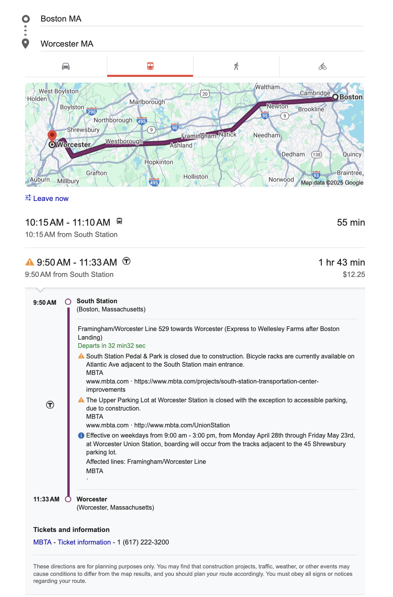
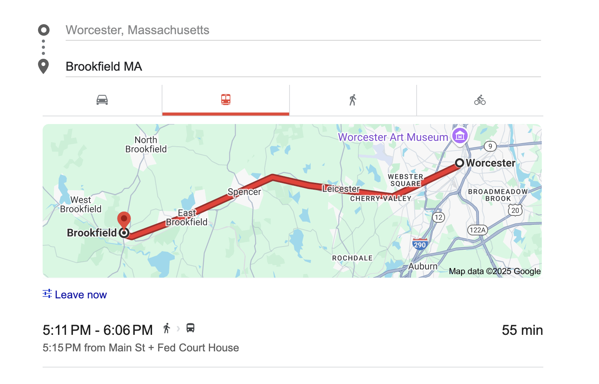
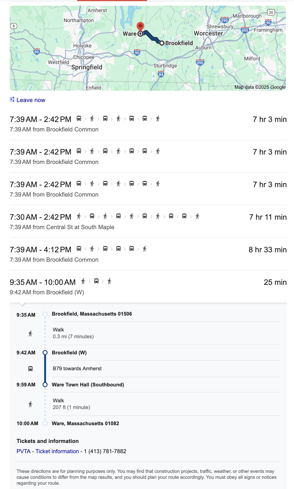
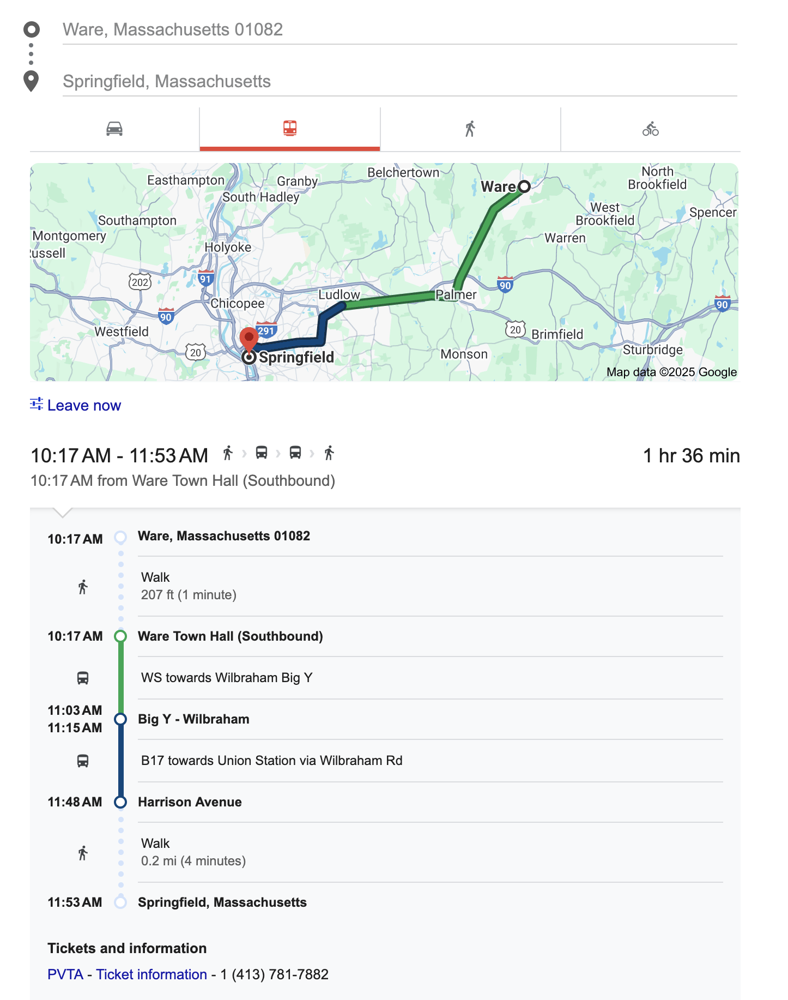
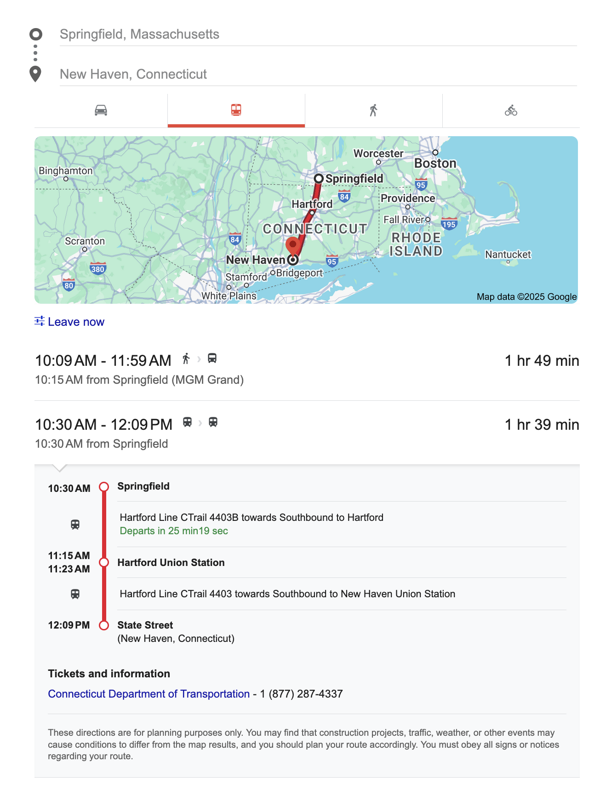
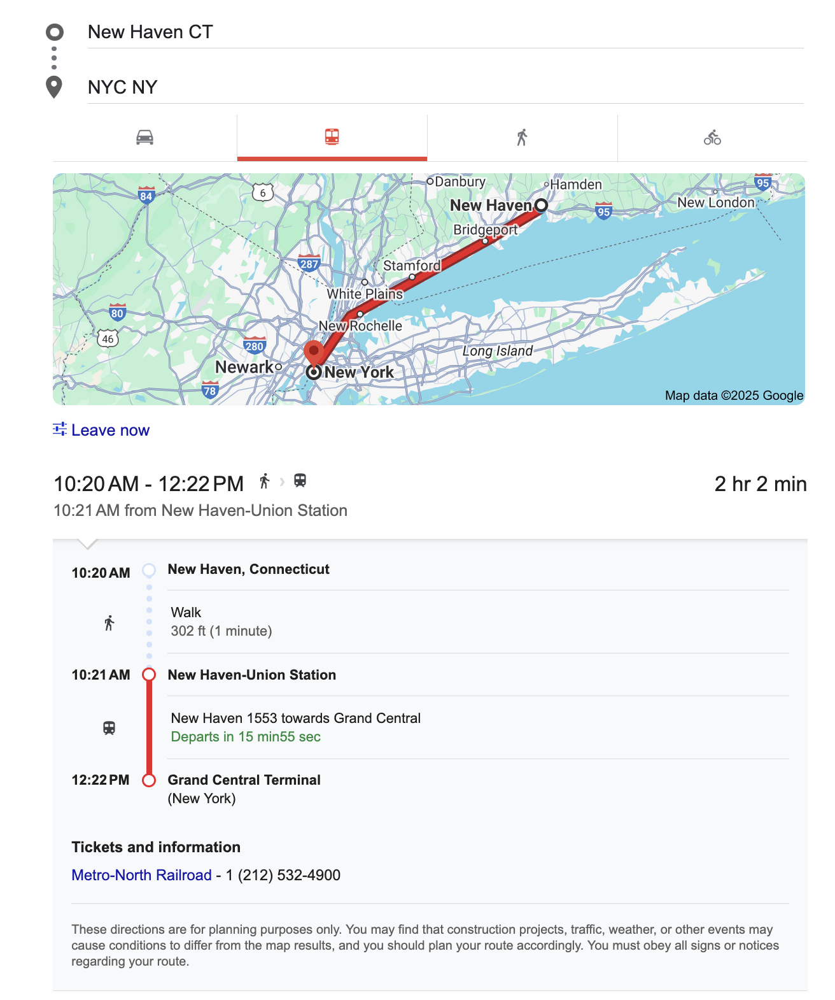

The typical ways to get from Boston to NYC are:

1. Flying
2. Driving
3. Taking an Amtrak
4. Taking a Greyhound

What are my _other_ options?

# Alternative A: Stringing together public transit systems

You can get from Boston to NYC with no car and no advanced booking of any kind, for <$50. It just takes a whole lot of patience:

1. Get from Boston to Worcester via the Commuter Rail:

- Cost: $12.25
- Time: 1 hour, 45 minutes

2. Get from Worcester to Brookfield via a Worcester RTA bus:

- Cost: Free (Worcester RTA has free fare at the moment)
- Time: 55 minutes

3. Get from Brookfield to Ware via the B79 PVTA bus:

- Cost: $3.50 (for our purposes - it's a $1.50 trip, but we want the PVTA day pass, because we have a second PVTA leg coming up)
- Time: 27 minutes

4. Get from Ware to Springfield via the WS PVTA bus, with a transfer in Ludlow to the B17 PVTA bus:

- Cost: free with pass
- Time: 1 hour, 36 minutes

5. Get from Springfield to New Haven via the CTRail Hartford Line:

- Cost: $13.25
- Time: 1 hour, 39 minutes

6. Get from New Haven to NYC via Metro North Railway:

- Cost: $18.25 if off-peak, $24.50 otherwise
- Time: 2 hours, 2 minutes

### Totals:

Cost: $47.25 to $53.50, depending on whether you get into New Haven at off-peak hours

Time: 8 hours & 24 minutes on vehicles, plus time spent waiting for transfers. The central and Western mass portions are a big risk here - the PVTA has 4 hour gaps between buses.
Transfers: 6

### Notes:

1. I was surprised at how much of a drag the New Haven to NYC portion is! I feel like I hear Yale students talk about how accessible NYC is from their campus. It feels high leverage for Connecticut to fund some improvements there. Relevant: If you bring an electric scooter or foldable bike and are willing to travel the 20 miles from New Haven to Bridgeport you can save another $3 + shave 30min off your train time.
2. I'm also surprised at the cost & time to go from Springfield to New Haven - its equivalent to the Boston to Worcester leg! Maybe the inter-state-ness of it makes subsidies harder to come by.
3. I feel like there surely has to be a way to get from Brookfield to Springfield (or at least Ludlow) directly, considering that the Brookfield->Ware and Ware->Springfield legs are both within the PVTA system. You're only allowed one transfer per PVTA fare, so maybe that's why I couldn't get Google to offer me that.
4. More generally, I feel more strongly now that a Worcester to Springfield connection would be powerful. The [East-West Rail](https://en.wikipedia.org/wiki/East_West_Rail) to connect Springfield and Boston with a one-seat ride is in-progress and exciting, but it feels like a direct bus from Worcester to Springfield would also be a high-leverage improvement, even just in the interim.
5. From a quick search, permitting Greyhound-type buses as part of this trip doesn't really bring cost down much, though it does help travel time + complexity. Worcester to NYC is $35-$40 on short notice, Springfield to NYC is $33, and New Haven to NYC is $16. Worcester to New Haven is $56-$65 (!), and Boston to Springfield is $21.

### Conclusions:

A Greyhound-style bus from Boston to NYC costs between $36 and $41, and takes 4 hours 35 minutes. An Amtrak can vary wildly - I've seen $16 tickets available from South Station, and even a bit lower if you get on at Route 128 just outside Boston; I've also seen booked-out days where the cheapest tickets are over $100. In general, though, I suspect that the bus or Amtrak will always beat the above trip on price - let alone the time and complexity you'd have to spend. The public transit options above mainly make sense if you're in central or Western Mass, and need to get to NYC - I'd rather do legs 3 through 6 above, compared to getting to Boston just to then catch NYC-bound transit.
